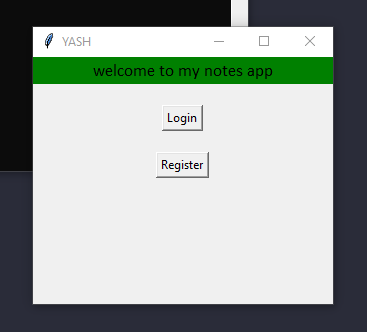
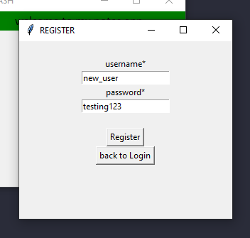
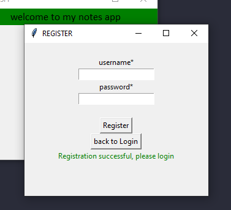
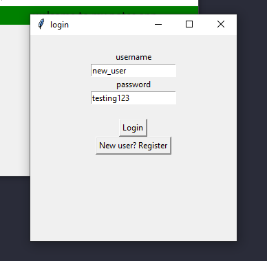
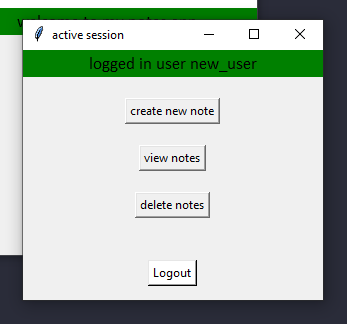
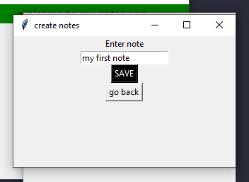
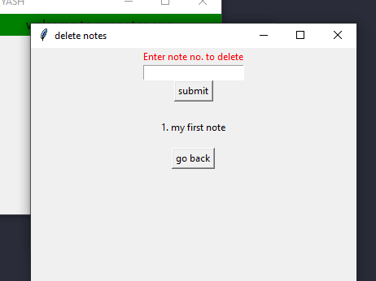
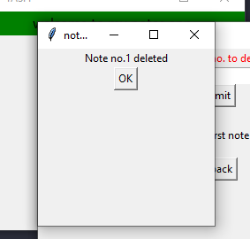

# simple-GUI-notes-app
A simple GUI application in python to save notes, and delete them as you like

## Login-Register
Create an account and then login, this way the app knows who's saving notes, and creates data files respectively

## Register

## Login

## Main page
After successfully loggin in

## Create notes

## View notes

## Delete notes

## Delete success

